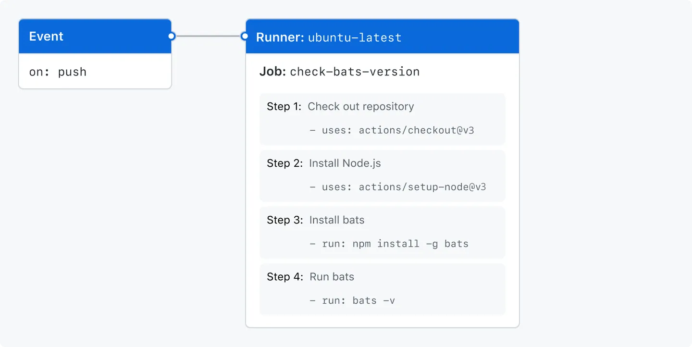

# Comprendre GitHub Actions

GitHub Actions est une plateforme d’intégration continue et livraison continue (CI/CD) qui vous permet d’automatiser votre pipeline de génération, de test et de déploiement.

## Vue d’ensemble

**Notions en relation**

- CI/CD
  - intégration continue et livraison continue
- DevOps 
- machines virtuelles

## Composants de GitHub Actions

- Workflow
- Événements
- travaux
- Actions
- Exécuteurs


```yml
name: learn-github-actions
run-name: ${{ github.actor }} is learning GitHub Actions
on: [push]
jobs:
  check-bats-version:
    runs-on: ubuntu-latest
    steps:
      - uses: actions/checkout@v4
      - uses: actions/setup-node@v3
        with:
          node-version: '14'
      - run: npm install -g bats
      - run: bats -v

```




## Références 
- [Comprendre GitHub Actions](https://docs.github.com/fr/actions/learn-github-actions/understanding-github-actions)


